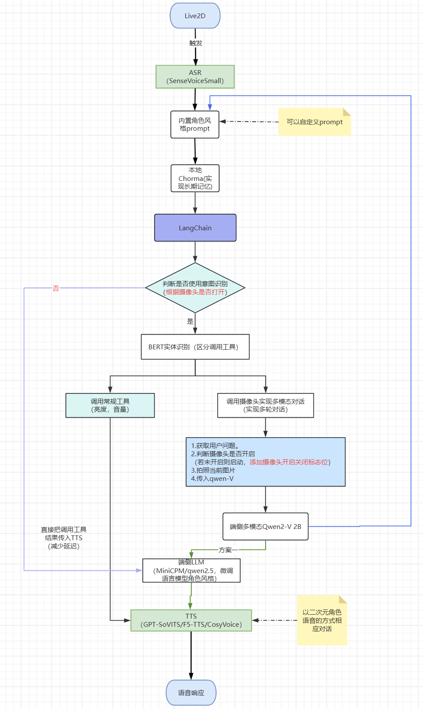
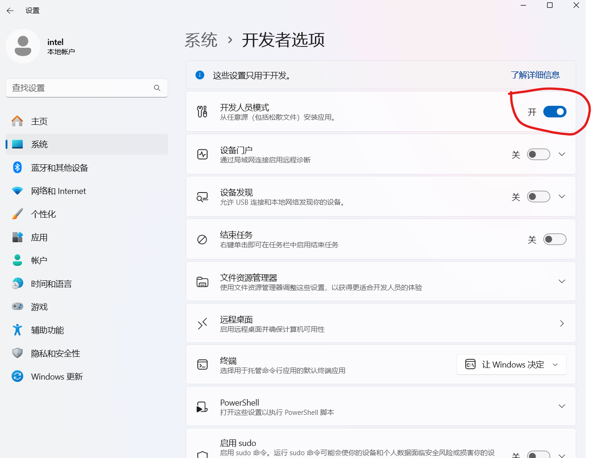

## 项目介绍
- 端侧AI桌宠助手，基于Intel AIPC的本地算力，结合Live2D二次元角色界面，提供个性化记忆对话和隐私保护的端侧AI桌宠助手。
- 该项目为[2024 AI+硬件创新大赛](https://competition.atomgit.com/competitionInfo?id=31577e662cba8dce522bb91b959e347e) 参赛项目，所选赛题为：“赛题一：基于成熟硬件（手机、PC、平板、汽车等），打造端云协同的AI应用”。

### 亮点介绍：
1. 我们采用心理咨询领域的专业知识，并结合胡桃角色的对话风格，对qwen2.5 7B模型进行了细致的微调，以提升其对话能力。

2. 通过ipex-ollama技术，我们将微调后的模型部署在Intel集成图形处理器（iGPU）上，以充分利用本地硬件资源，实现高效的模型运行。

3. 利用Langchain的长短期记忆模块，并结合本地向量数据库存储对话信息，我们让AI桌宠更加理解用户，提供更加个性化的交互体验。

4. 通过整合BERT意图分类与实体识别模型，并借助OpenVino技术及AIPC上的NPU硬件，我们成功打造了一个低延迟（10ms左右）、高效能的智能控制系统。该系统能够无缝操控多种设备，包括调节电脑亮度、音量、摄像头等，涵盖超过十项实用功能。这一创新为用户带来了近似端侧贾维斯的智能化体验，极大地提升了操作便捷性与响应速度。

5. 结合自动语音识别（ASR）、大型语言模型（LLM）和文本转语音（TTS）技术，我们通过特定关键词“胡桃胡桃”实现语音唤醒功能，自动识别用户对话内容，打造出具有胡桃二次元角色特色的语音对话体验，并实现语音控制工具调用的能力。

6. 参考OpenVINO对OpenVoice-v1的适配指南，我们顺利完成了OpenVoice-v2的适配工作。在此基础上，我们进一步运用NNCF对OpenVINO v2进行了4/8 bit模型量化处理，不仅显著提升了语音生成的质量，还大幅降低了响应延迟，从而实现了更高效、更迅捷的语音生成体验。依托OpenVoice-V2强大的语音克隆能力，我们能够基于任意一个参考音频和需要输出的文本，生成与参考音频高度匹配的语音，极大地提升了语音生成的可玩性和灵活性。

7. 端侧模型的实现确保了隐私数据的本地化处理，最大程度上保护了用户的隐私安全。

### 产品简介：
一款端侧AI桌宠助手，依托于Intel AIPC的强大本地计算能力，采用Live2D技术打造的二次元角色界面，为您的AI助手带来生动的视觉体验。这款助手能够持续记忆对话内容，实现深度个性化的AI交互体验。通过定制化的语音交互，它能够控制PC的多项功能，如调整屏幕亮度、音量以及摄像头设置。所有关键信息均存储于本地，确保您的隐私安全。此外，我们还可以针对不同角色IP定制语言风格和语音音色，以满足您的个性化需求。我们致力于创造一款完全在端侧运行的AI桌宠助手，让您的数字生活更加丰富多彩。


### 主要功能
1. 微调的对话模型：基于心理咨询专业知识和胡桃角色的对话风格，微调了qwen2.5 7B模型，提升其对话能力。
2. 本地硬件部署：利用ipex-ollama技术，将微调后的模型部署在Intel集成图形处理器（iGPU）上，确保高效运行。
3. 个性化对话体验：通过Langchain的长短期记忆模块和本地向量数据库存储对话信息，提升AI桌宠的用户理解能力和互动体验。
4. 多工具控制：结合BERT意图分类和实体识别模型，实现低延迟控制多个工具（如调整电脑亮度、音量、摄像头等）功能，提供类似端侧贾维斯的智能体验。
5. 语音唤醒与控制：通过自动语音识别（ASR）、大型语言模型（LLM）和文本转语音（TTS）技术，支持语音唤醒（“胡桃胡桃”）及语音控制工具调用。
6. 优化语音生成速度：完成openvino对OpenVoice-v2的适配，提升语音生成效果以及大幅度降低了响应延迟。
7. 个性化语音克隆：只需提供一个参考音频（当前默认是胡桃的音频）和所需输出的文本，OpenVoice-V2就能生成与参考音频高度匹配的语音，无论是模仿名人声音、再现经典台词，还是创造全新的角色声音，都能轻松实现。
8. 隐私保护：端侧模型确保隐私数据本地处理，保护用户隐私安全。

## 项目结构


## 支持的tools
1. 调整音量   (完成)
2. 调整亮度   (完成)
3. 检测电池状态 (完成) 适用于笔记本电脑，查询电池电量和剩余使用时间。
4. 开启/关闭省电模式  (完成)
5. 开启/关闭飞行模式  (完成)
6. 打开/关闭计算器  (完成)
7. 打开/关闭任务管理器 (完成)
8. 截图当前窗口并保存到桌面  (完成)
9. 获取系统基本信息  (完成)
10. 打开/关闭摄像头,拍一张照片 (完成)
11. 调用摄像头拍照，并把照片传给qwenV模型响应 (完成)


## 准备工作
1. 需要英特尔AIPC，因为本项目需要借助openvino框架将模型离线运行在英特尔CPU/GPU/NPU平台。
2. 需要已安装GPU/NPU驱动。Windows用户可以通过ctrl+alt+del组合键，选择任务管理器，选择`性能`来查看是否有英特尔GPU和英特尔NPU。
3. 需要已安装anaconda。
4. 克隆本项目，进入项目路径。
    ```bash
    git clone https://github.com/shenyiliu/AI_Pet_Companion.git
    cd AI_Pet_Companion
    ```
5. 去huggingface下载[Qwen2.5-7B-Instruct](https://hf-mirror.com/Qwen/Qwen2.5-7B-Instruct)和[Qwen2-VL-2B-Instruct](https://hf-mirror.com/Qwen/Qwen2-VL-2B-Instruct)模型，放置到本项目的`download`目录。网络不畅的，可以使用hf-mirror.com。
6. 去魔搭下载[SenseVoiceSmall](https://modelscope.cn/models/iic/SenseVoiceSmall)和[speech_fsmn_vad_zh-cn-16k-common-pytorch](https://modelscope.cn/models/iic/speech_fsmn_vad_zh-cn-16k-common-pytorch)，放置到本项目的`download`目录。
7. 使用anaconda创建并激活一个虚拟环境，比如可以叫`openvino`，可以参考下面的命令。
    ```shell
    conda create --name openvino python=3.10.15 -y
    conda activate openvino
    ```
8. 安装依赖
    ```bash
    pip install -r requirements.txt -i https://mirrors.aliyun.com/pypi/simple/
    ```
9. 输入下面这条命令验证openvino，观察其支持的设备，理论上应该会输出`['CPU', 'GPU', 'NPU']`，如果打印结果缺少GPU或者NPU，请检查驱动是否正常。
    ```shell
    python -c "import openvino as ov; core = ov.Core(); print(core.available_devices)"
    ```

## 部署工作
### 第一步：部署LLM
- 数据生成以及模型lora微调过程 + 模型权重合并过程：[点击跳转](./notebook/train_llm_with_lora/)
- 训练好的lora模型权重
  - 123盘：https://www.123684.com/s/oEqDVv-kfBo? 提取码:iu9D
- 将合并后的权重放置到 output/Qwen2.5-7B-Instruct-Lora-Merge
- [参考教程](https://github.com/intel-analytics/ipex-llm/blob/main/docs/mddocs/Quickstart/llama_cpp_quickstart.zh-CN.md)
#### 1.1.安装ipex-ollama
- 参考[ipex-ollama安装包](https://www.123684.com/s/iPX7Td-LEfrh) 提取码:YLSU，链接中有转换好的微调后的GGUF模型文件
- 双击ipex-llm-ollama-Installer-20241118.exe安装，不建议更改安装路径。
- 如果已经安装了ollama，建议卸载，否则会冲突（例如端口被占用，环境变量冲突）
#### 1.2.将微调后的模型转换为GGUF (可选)
##### 环境配置
1.2.1 新建一个虚拟环境，安装ipex-llm
```bash
conda create -n llm-cpp python=3.11
conda activate llm-cpp
pip install --pre --upgrade ipex-llm[cpp]

```
1.2.2 对于Win10/Win11系统，打开设置，搜索开发者设置，勾选`开发者模式`。不开启则下面运行api会报没有权限创建软链接。[参考链接](https://www.scivision.dev/windows-symbolic-link-permission-enable/)

1.2.3 运行下面的命令，初始化llama-cpp，初始化后，可以在llama-cpp目录看到很多文件，例如`convert_hf_to_gguf.py`就是其中之一。
```bash
mkdir llama-cpp
cd llama-cpp
init-llama-cpp.bat
```
1.2.4 将微调前的模型`Qwen2.5-7B-Instruct`里面的几个json复制到微调后的模型文件夹，覆盖过去，否则转gguf会报错。包含下面几个json文件。
```bash
config.json
generation_config.json
tokenizer_config.json
tokenizer.json
vocab.json
```
1.2.5 转换模型为GGUF格式。这里的模型路径可以根据你实际的模型存储路径来修改，一般会将所有模型存放在项目根目录下的`output`文件夹下
``` bash
python convert_hf_to_gguf.py ../output/Qwen2.5-7B-Instruct-Lora-Merge --outfile ../output/qwen2.5_lora.gguf
```
1.2.6 模型量化
``` cmd
./llama-quantize.exe ../output/qwen2.5_lora.gguf  ../output/qwen2.5_lora_Q4_K_M.GGUF Q4_K_M
```

##### 1.3测试模型
在命令行中运行
``` cmd
set SYCL_CACHE_PERSISTENT=1
set SYCL_PI_LEVEL_ZERO_USE_IMMEDIATE_COMMANDLISTS=1

./llama-cli.exe -m ../output/qwen2.5_lora_Q4_K_M.GGUF -p "Please be aware that your codename in this  conversation is ‘胡桃'  ‘Hutao’,别人称呼你‘胡桃’‘堂主’‘往生堂堂主’上文给定了一些游戏中的经典桥段。作为胡桃/`Hutao`，你需要扮演一个心理咨询师，帮助对方解决问题。如果我问的问题和游戏中的台词高度重复，那你就配合我进行演出。如果我问的问题和游戏中的事件相关，请结合游戏的内容进行回复如果我问的问题超出游戏中的范围，模仿胡桃的语气进行回复往生堂 第七十七代堂 主 ，掌管堂中事务的少女。身居堂主之位，却没有半分架子。她的鬼点子，比瑶光滩上的海砂都多。对胡桃的评价：「难以捉摸的奇妙人物，切莫小看了她。不过，你若喜欢惊喜，可一定要见见她。」单看外形似乎只是个古灵精怪的快乐少女，谁能想到她就是的大名鼎鼎的传说级人物——胡桃。既是「往生堂」堂主，也是璃月「著名」诗人，胡桃的每一重身份都堪称奇妙。她总是飞快地出现又消失，犹如闪电与火花并行，甫一现身便点燃一切。平日里，胡桃俨然是个贪玩孩子，一有闲功夫便四处乱逛，被邻里看作甩手掌柜。唯有葬礼上亲自带领仪信队伍走过繁灯落尽的街道时，她才会表现出 凝重、肃穆 的一面。" -ngl 99 -cnv 
```
##### 1.4 量化后的GGUF模型添加到ollama中
1.4.1 需要先启动ipex-ollama服务。打开ipex-ollama的安装路径，默认安装在`C:\Users\{你的用户名}\ipex-llm-ollama`，双击启动start.bat。

1.4.2 打开环境变量设置，将ipex-ollama的路径加到Path环境变量中。此时另开一个终端，测试`ollama --help`，如果输出为下面的信息，则代表ok。(不行你就重启一下电脑生效咯，其实重开一下软件就可以了)
```bash
Large language model runner

Usage:
  ollama [flags]
  ollama [command]

Available Commands:
  serve       Start ollama
  create      Create a model from a Modelfile
  show        Show information for a model
  run         Run a model
  pull        Pull a model from a registry
  push        Push a model to a registry
  list        List models
  ps          List running models
  cp          Copy a model
  rm          Remove a model
  help        Help about any command

Flags:
  -h, --help      help for ollama
  -v, --version   Show version information

Use "ollama [command] --help" for more information about a command.
```
1.4.3 导入文件到ollama中。先返回到项目根目录，再执行下面的命令创建一个名为`qwen2.5_lora_Q4_K_M`的模型。
```bash
cd ..
ollama create qwen2.5_lora_Q4_K_M -f Modelfile
```
- Modelfile文件在项目根路径下，如果运行报错，请检查模型路径是否正确。

##### 1.5 添加向量模型
- 拉取镜像（暂时不用启动，等api调用时自动启动）
```bash
ollama pull nomic-embed-text:latest
```

### 第二步：部署bert意图分类器
- 数据生成过程：[点击跳转](./notebook/gen_data_for_bert)
- [部署文档](./bert_tools/README.md)
- 部署后快捷启动办法
```bash
.\2-start_bert.bat
```


### 第三步：转换Qwen2-VL-2B-Instruct为OpenVino格式
1. 确保`Qwen2-VL-2B-Instruct`已下载到download目录。
2. 进入`convert_Qwen2VL`目录，运行`convert.py`程序。
```bash
cd convert_Qwen2VL
python convert.py
```
3. 运行`run_demo.py`测试转换后的模型能否正常加载。
```bash
python run_demo.py
```


### 第四步：部署ASR(Automatic Speech Recognition 自动语音识别)服务 + 若干系统工具

- 复用之前创建的openvino虚拟环境，cmd运行下面的命令就可以运行了。
```bash
.\3-start_asr.bat
```


### 第五步：部署TTS(Text To Speech 语音合成)服务
- 采用[OpenVoice](https://github.com/myshell-ai/OpenVoice)开源项目的V2版本，使用Intel OpenVino进行推理加速。
- [部署文档](./open_voice_v2/README.md)
- 部署后快捷启动办法
```bash
.\4-start_tts.bat
```

### 第六步：部署卡通人
1. 采用[https://github.com/zenghongtu/PPet?tab=readme-ov-file](https://github.com/zenghongtu/PPet?tab=readme-ov-file)项目
2. 可以复用第一步创建的openvino环境。
    ```bash
    conda activate openvino
    ```
3. 使用conda安装nodejs。
    ```bash
    conda install -c anaconda nodejs
    ```
4. 安装pnpm，并设置npm仓库为国内源，加快下载速度。
    ```bash
    npm install -g pnpm -i --registry=https://registry.npmmirror.com
    pnpm config set registry https://registry.npmmirror.com
    ```
5. 进入本项目的PPet文件夹，安装依赖。
    ```bash
    cd PPet
    pnpm i
    ```
6. 启动PPet项目。
   ```bash
   pnpm start
   ```

7. 可以通过语音直接进行对话，唤醒关键词为“胡桃胡桃”（注：需要电脑支持麦克风）


## 项目演示视频
- 待上传