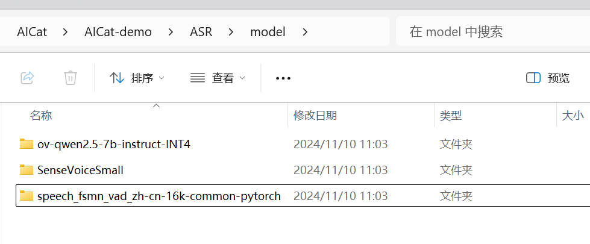
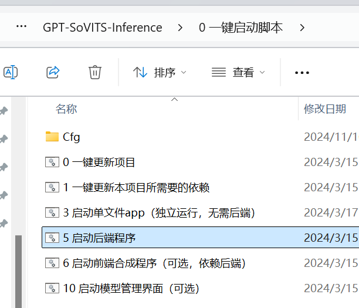

# LLM OpenVINO

使用qwen2.5 7B

## 环境

```Python
conda create --name LLM-openvino python=3.10
conda activate LLM-openvino
python -m pip install --upgrade pip
# pip install openvino-genai==2024.4.0
pip install --pre -U openvino-genai --extra-index-url https://storage.openvinotoolkit.org/simple/wheels/nightly

pip install --upgrade --upgrade-strategy eager "optimum[openvino]"
```


出现报错，无法将LLM的分词器转换成功

```Python
# 报错
Exporting tokenizers to OpenVINO is not supported for tokenizers version > 0.19 and openvino version <= 2024.4. Please downgrade to tokenizers version <= 0.19 to export tokenizers to OpenVINO.
```


解决办法

```Python
# 1.更新最新版本
pip uninstall -y openvino openvino-tokenizers openvino-genai

pip install --pre -U openvino-genai --extra-index-url https://storage.openvinotoolkit.org/simple/wheels/nightly

# 2.版本降级（可选）
pip install transformer<4.45 tokenizers<0.19
```


模型转换

```Python
optimum-cli export openvino --model D:\LianXi\LLM\Qwen2.5-7B-Instruct --weight-format int4 --task text-generation-with-past ov-qwen2.5-7b-instruct-INT4
```


把转换好的LLM模型放到ASR/model这个文件夹下，国内用户去魔搭社区下载下面两个模型。

ASR： SenseVoiceSmall

VAD:   speech_fsmn_vad_zh-cn-16k-common-pytorch


ASR/model文件夹下正确存放示例



## 启动

```Python
python Voice.py
```


# TTS


用的是开源项目：[GPT-SoVITS-Inference](https://github.com/X-T-E-R/GPT-SoVITS-Inference)


启动TTS

1.直接下载的：[https://huggingface.co/XTer123/GSVI_prezip/tree/main](https://huggingface.co/XTer123/GSVI_prezip/tree/main)

2.进入GSVI-2.2.4-240318\GPT-SoVITS-Inference\0 一键启动脚本这个目录

启动：5 启动后端程序




# Live2D

使用项目

[https://github.com/zenghongtu/PPet?tab=readme-ov-file](https://github.com/zenghongtu/PPet?tab=readme-ov-file)


## 环境

```Python
conda create -n Live2D python=3.10 -y
activate Live2D

cd PPet

conda install -c anaconda nodejs
npm install -g pnpm
pnpm config set registry https://registry.npmmirror.com

```


## 运行

```Python
# 安装依赖
pnpm i

# 运行程序
pnpm start
```


# 启动整个项目

先启动TTS、LLM

然后再启动Live2D，点击一下人物即可开始录音，再点击一下停止录音


